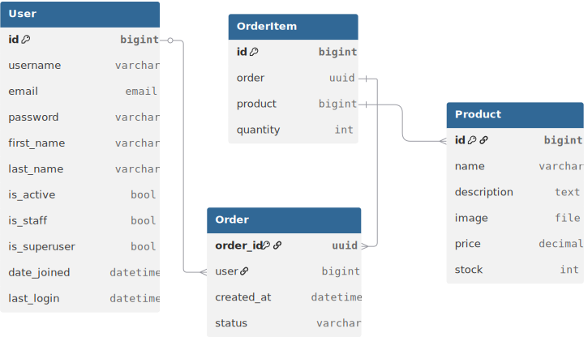

# Online Shop API

This project is a **Django REST API** backend for an online shop. There is **no React or frontend client** included in this repository — it's strictly backend functionality for managing products, orders, and users.

- by [Mohammad Mousapour](https://github.com/mmd-punisher)
---

## 📦 Database Structure

The database is designed to manage users, products, and orders efficiently:

- **User Table**:  
  Stores user information, authentication details, and permission flags. Built using Django's authentication system (extending `AbstractBaseUser` and `PermissionsMixin` under the hood).

- **Product Table**:  
  Contains product details like name, description, price, image, and available stock.

- **Order Table**:  
  Represents customer orders, linked to users. Tracks the order creation date and current status.

- **OrderItem Table**:  
  Each item in an order, representing a product and its quantity. Connected to both the `Order` and `Product` tables.

Relationships:
- Each **Order** belongs to a **User**.
- Each **OrderItem** belongs to an **Order** and references a **Product**.

---

That’s it for now. 🛵
